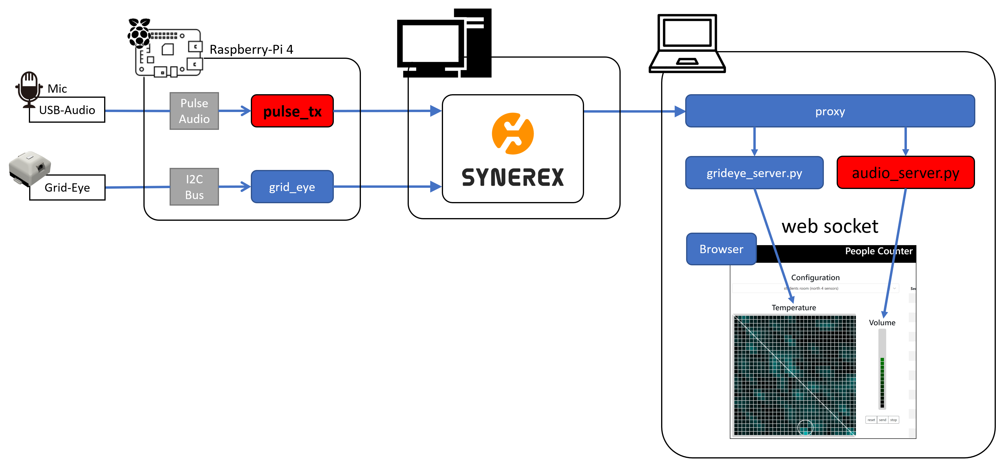

# 1.概要

本書は、以下の手順について説明する。

## システム構成

## （Pulse Audio）ラズパイ環境におけるGrid-EYE Syetem Pulse Audio モジュールについて

- 環境変数の設定
- Pulse Audio モジュールのインストール
- Pulse Audio モジュールの起動
- Pulse Audio モジュールの実行結果

## （audioserve）Pulse Audio データの可視化について

- Pulse Audio データの可視化概要
- audioserveのインストール
- audioserveの起動と可視化表示

