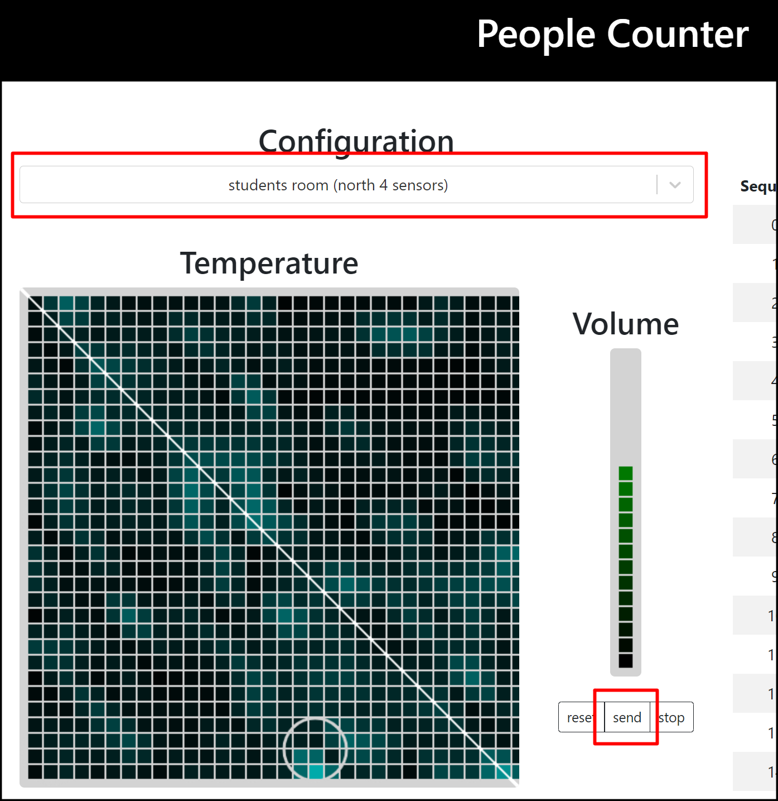

# 9.audioserveの起動と可視化表示

audioserveを起動するためのコマンド（例）を以下に記述する。

### Synerex Proxy起動（例）

```
./proxy -nodesrv 192.168.207.165:9990 -channel 19 -verbose
```


## audioserveの起動

新しいターミナルを開き以下実行する。

```
（カレントディレクトリ：python_provider_grideye）
$ python receiveSupply.py
```


## webpage serverの起動

新しいターミナルを開き以下実行する。

```
（カレントディレクトリ：python_provider_grideye）
$ cd client/build
$ python -m http.sever
```


## 可視化表示

ブラウザを立ち上げ、URLに「127.0.0.1:8000」を入力する。

表示が切り替わらないない場合は、前項「webpage server」をctrl+cで一度停止し、再度実行すると表示することがある。


