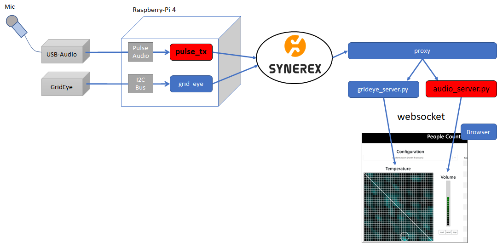

# 1. 概要

本書は、Grid-EYE systemを構成するPulse Audio音声関連モジュール（pulse_tx、audio_server.py）に関する手順について説明する。

## システム構成

※本書で説明する機種のIPアドレスを以下に仮定する。

|  #   | 機種           | IPアドレス    |
| :--: | -------------- | ------------- |
|  1   | Raspberry-Pi 4 | 192.168.0.50  |
|  2   | Synerex Server | 192.168.0.100 |
|  3   | Client         | 192.168.0.200 |

## pulse_tx

ラズパイ環境におけるGrid-EYE Syetem Pulse Audio モジュールについて

- 環境変数の設定
- Pulse Audio モジュールのインストール
- Pulse Audio モジュールの起動
- Pulse Audio モジュールの実行結果

## audio_server.py

Pulse Audio データの可視化について

- Pulse Audio データの可視化概要
- audio_serverのインストール
- audio_serverの起動と可視化表示

