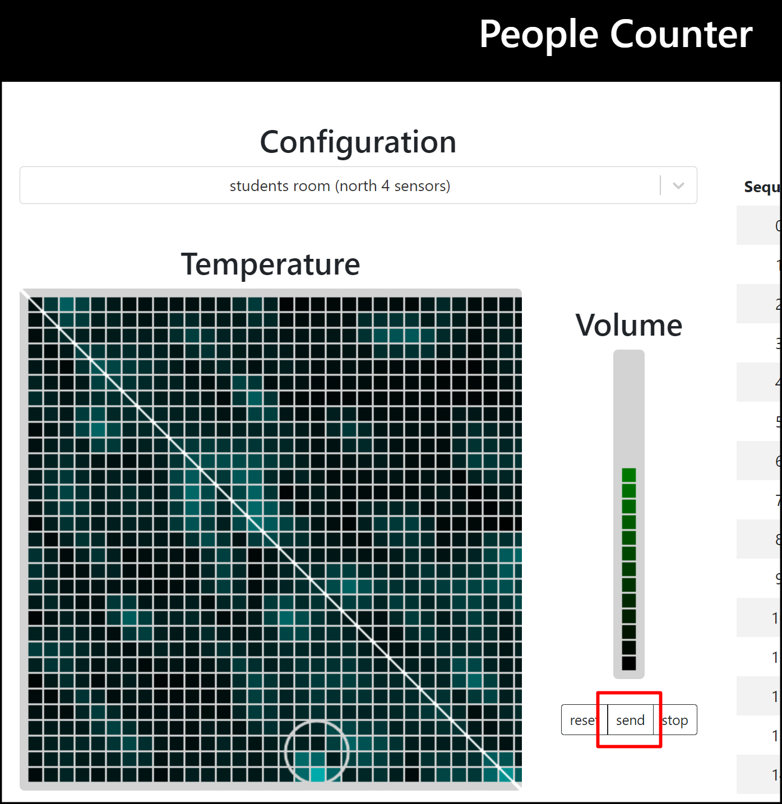

# 9. audio_serverの起動と可視化表示

audio_serverを起動するためのコマンド（例）を以下に記述する。

### Synerex Proxy起動（例）

```
$ ./proxy -nodesrv 192.168.0.100:9990 -channel 19 -verbose
```


## audio_serverの起動

新しいターミナルを開き以下実行する。

```
（カレントディレクトリ：provider_people_counter）
$ python audio_server.py
```


## webpage serverの起動

新しいターミナルを開き以下実行する。

```
（カレントディレクトリ：provider_people_counter）
$ cd client/out
$ python -m http.server
```


## 可視化表示

ブラウザを立ち上げ、URLに「127.0.0.1:8000」を入力し、「send」キーを押下する。

しばらく待っても表示が切り替わらない場合は、以下の方法を試すと表示することがある。

- 前項「webpage server」をctrl+cで一度停止し、再度実行する。

- マイクに息を吹きかけるなどの、ある程度大きめのマイク入力をする。



